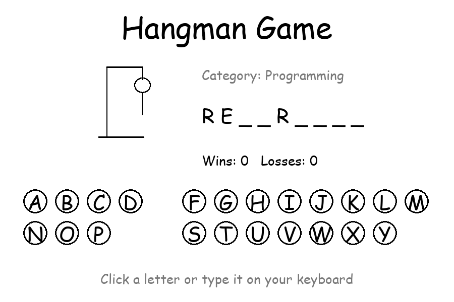
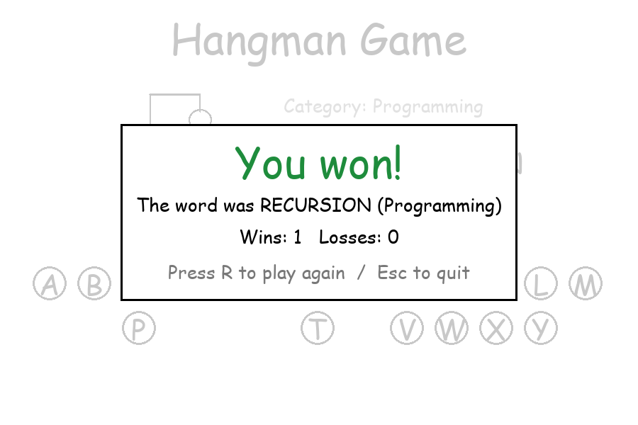

# Hangman Game

The classic word-guessing game with a graphical interface, built with Python and Pygame.
Guess the hidden word one letter at a time before the hangman drawing is complete.



## Features

- **Mouse and keyboard input**: click the on-screen letters or type them.
- **Word categories**: 60 words in 4 categories (Animals, Countries, Programming, Food), loaded from `words.json`. The category is shown as a hint.
- **Hangman drawing** that grows with every wrong guess (6 wrong guesses and you lose).
- **End screen** after each round: win/lose message, the answer, and the score. Press **R** to play again or **Esc** to quit.
- **Score tracking** (wins and losses) across rounds; the same word is never picked twice in a row.
- Game rules live in `hangman_logic.py`, separate from the drawing code, and are unit-tested.



## How to run

Requires Python 3.8+.

```bash
git clone https://github.com/naniiic137/Hangman-Game.git
cd Hangman-Game

python -m venv .venv
# Windows: .venv\Scripts\activate    macOS/Linux: source .venv/bin/activate
pip install -r requirements.txt

python main.py
```

Paths are built from the script's location, so `python path/to/Hangman-Game/main.py` also works from any folder.

## Controls

| Action | Input |
| --- | --- |
| Guess a letter | click it, or press the key |
| Play again (after a round) | `R` |
| Quit | `Esc` or close the window |

## Adding your own words

Edit `words.json`. Each key is a category, and each value is a list of words (letters A–Z only;
anything else is ignored):

```json
{
  "Animals": ["elephant", "giraffe"],
  "Sports": ["football", "tennis"]
}
```

## Running the tests

```bash
python -m unittest -v
```

## Project structure

```text
main.py                 # Pygame window, drawing, input handling and game loop
hangman_logic.py        # game rules: guesses, win/lose, word loading (no Pygame)
test_hangman_logic.py   # unit tests (unittest)
words.json              # word list by category
images/                 # hangman0.png ... hangman6.png, one per wrong guess
screenshots/            # images used in this README
requirements.txt        # pygame
```

## Limitations

- Fixed 900×600 window (not resizable).
- Words must be single words with letters A–Z (no spaces, hyphens or accents).
- The score resets when you close the game.

## Credits

Initial structure inspired by Tech With Tim's pygame Hangman tutorial; extended with keyboard input,
categorised word lists loaded from JSON, an end screen with replay, score tracking across rounds,
and unit-tested game logic separated from the UI.

## License

© 2026 Hamza Ben Ismail. All rights reserved.
